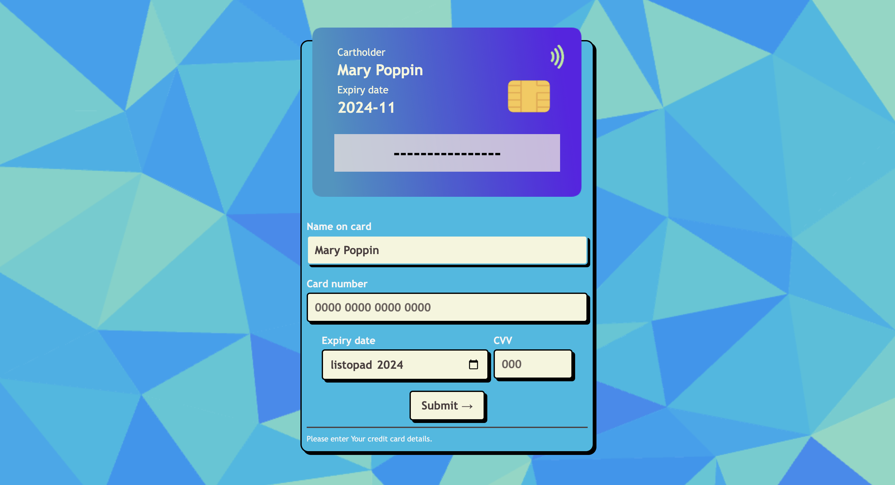

# 🔮 Credit Card form 🔮

Simple project is React, where I can store the objects in state and working with it. Also it's nice remainder of working with form THUS handling the change in the inputs. Credit card's number (to be more specific - its start numbers) I can use to create a specific card visuals ! If that's not fascinating, I don't know what is :D

## 🃏 First look 

On the front You can insert Your basic information - depending on Your number's start the background of the card (one among the three) is shown. What You put into proper input, at the same time appears on the card.

By when You start writing a CVV number, the front is switched to back. Amazing, is not? ;)

## 🃏 Technologies

+ finally React !

## 🃏 Inspiration
This little project is part of an amazing Full Stack Developer Course created by  ♥ Ania Kubow ♥. Love this women, her sense of humor and ability to explain hard code-things in a way that I finally understand. 🏆

***

## Getting Started with Create React App

This project was bootstrapped with [Create React App](https://github.com/facebook/create-react-app).

